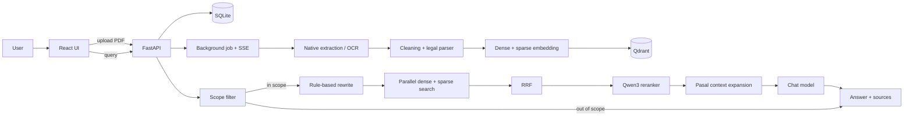

# PRD — Indonesian Labor Law RAG

## 1. Ringkasan

Indonesian Labor Law RAG adalah aplikasi web dan REST API untuk menjawab
pertanyaan hukum ketenagakerjaan Indonesia berdasarkan PDF yang diunggah pengguna.

Alur utama:

`PDF → extraction/OCR → parsing hukum → embedding → Qdrant → retrieval → reranking → jawaban bersumber`

Corpus utama:

- UU No. 13 Tahun 2003 tentang Ketenagakerjaan.
- PP No. 35 Tahun 2021 tentang PKWT, Alih Daya, Waktu Kerja, dan PHK.

Jawaban diberikan dalam Bahasa Indonesia dan hanya menggunakan konteks dokumen
hasil retrieval.

## 2. Tujuan

- Memproses PDF native maupun hasil scan.
- Mempertahankan struktur BAB, Pasal, Ayat, dan nomor halaman.
- Menyediakan pencarian dense+sparse dengan reranking.
- Menampilkan sumber, chunk, halaman, dan rerank score.
- Menolak pertanyaan di luar hukum ketenagakerjaan.
- Memberi tahu pengguna jika bukti tidak cukup.
- Menyediakan setup sederhana melalui Docker Compose.

## 3. Pengguna dan use case

Pengguna utama adalah evaluator technical test atau pengguna yang mencari
informasi dalam dokumen hukum ketenagakerjaan.

Use case utama:

1. Upload satu atau beberapa PDF.
2. Pantau progress parsing, embedding, dan indexing.
3. Ajukan pertanyaan dalam Bahasa Indonesia.
4. Lihat jawaban, query rewrite, sumber, dan score.
5. Buka chunk sumber untuk verifikasi.

## 4. Scope

### Termasuk

- React UI dan FastAPI REST API.
- Background ingestion dengan progress SSE.
- PyMuPDF, Tesseract Bahasa Indonesia, dan legal structure parsing.
- BGE-M3 dense+sparse embedding melalui DeepInfra.
- Qdrant, RRF fusion, dan Qwen3 reranker.
- SQLite document registry berbasis SHA-256.
- Parent-context expansion pada tingkat Pasal.
- Grounded generation dan citation.
- Dockerfile frontend/backend serta Docker Compose.

### Tidak termasuk

- Authentication, user management, dan multi-tenancy.
- Crawling regulasi dari internet.
- Persistent conversation history.
- Admin dashboard.
- Automatic document replacement/deletion.
- Durable job queue atau multi-replica deployment.
- Fine-tuning dan retrieval evaluation dashboard.
- Legal advice atau keputusan hukum final.

## 5. Alur sistem



## 6. Functional requirements

### FR-01 — Upload dan progress

- Endpoint upload: `POST /v1/documents/upload` dengan field multipart `files`.
- Hanya file `.pdf` yang diproses.
- API segera mengembalikan `job_id`; proses berjalan di background.
- Progress tersedia melalui `GET /v1/documents/{job_id}/events` (SSE).
- Status fallback tersedia melalui `GET /v1/documents/{job_id}/status`.
- Status: `upload`, `parsing`, `embedding`, `indexing`, `completed`, `failed`.
- Kegagalan satu file tidak menghentikan file lain dalam job yang sama.

### FR-02 — Registry dokumen

- SHA-256 file disimpan di SQLite.
- File identik dengan status `queued`, `processing`, atau `completed` ditolak.
- Jika seluruh file duplikat, API mengembalikan HTTP 409.
- Ingestion berstatus `failed` dapat dicoba ulang.

### FR-03 — Extraction dan chunking

- Native text selalu dicoba terlebih dahulu.
- OCR digunakan jika native text < 200 karakter dan gambar terbesar mencakup
  minimal 70% halaman.
- OCR memakai Tesseract `ind` pada 300 DPI; maksimal empat process worker.
- Teks dibersihkan dari karakter/whitespace rusak dan header/footer berulang.
- Parser mengenali BAB, Bagian, Paragraf, Pasal, dan Ayat.
- Parsing berhenti pada heading `PENJELASAN`; teks sebelum Pasal tidak dibuat chunk.
- Chunk berisi Pasal/Ayat, maksimal 1.000 karakter, tanpa overlap.
- Metadata halaman disimpan pada setiap chunk.

### FR-04 — Indexing

- Model default: `BAAI/bge-m3-multi` melalui DeepInfra.
- Embedding mengaktifkan dense dan sparse, dengan normalisasi.
- Batch embedding default berisi 8 chunk.
- Qdrant memakai named vector `dense` (Cosine) dan `sparse` (IDF modifier).
- Chunk disimpan sebagai JSONL di `backend/data/chunks/*.jsonl` dan sebagai
  payload Qdrant.

### FR-05 — Query dan retrieval

- Endpoint query: `POST /v1/query` dengan body `{"query": "..."}`.
- Panjang query 1–2.000 karakter; query kosong menghasilkan HTTP 422.
- Scope filter LLM berjalan sebelum embedding dan retrieval.
- Query di luar scope menghasilkan penolakan, `filtered = true`, dan sources kosong.
- Query yang lolos dinormalisasi dan di-rewrite secara rule-based.
- Dense dan sparse search berjalan paralel, lalu digabung dengan RRF.
- Default retrieval maksimal 20 kandidat (`RRF_K=60`).
- Reranker default `Qwen/Qwen3-Reranker-4B` mengambil maksimal 7 hasil dan
  membuang score di bawah `RERANK_MIN_SCORE=0.05`.
- Parent context mengambil chunk Pasal yang sama, maksimal 6.000 karakter.
- Jika tidak ada bukti yang lolos, generation LLM tidak dijalankan.

### FR-06 — Jawaban dan sumber

- Jawaban menggunakan Bahasa Indonesia dan context dokumen saja.
- Klaim diberi citation `[1]`, `[2]`, dan seterusnya.
- Marker reasoning dan Markdown presentasional dibersihkan.
- Jika citation tidak dibuat model, backend menambahkan nomor sumber otomatis.
- Source menampilkan dokumen, halaman, BAB, Pasal, Ayat, `chunk_id`, text, dan
  `rerank_score`.

## 7. API response

```json
{
  "answer": "Jawaban berdasarkan context [1].",
  "sources": [
    {
      "id": 1,
      "document": "PP No. 35 Tahun 2021.pdf",
      "page": 7,
      "page_end": 7,
      "chapter": "II",
      "article": "Pasal 8",
      "paragraph": "Ayat 1",
      "chunk_id": "pp35-pasal8-ayat1-part1",
      "text": "...",
      "rerank_score": 0.912345
    }
  ],
  "retrieval": {
    "query": "Berapa lama maksimal PKWT?",
    "normalized_query": "Berapa lama maksimal PKWT?",
    "rewritten_query": "Berapa lama maksimal PKWT? menurut peraturan ketenagakerjaan Indonesia",
    "candidate_chunks": 20,
    "reranked_chunks": 7,
    "retrieved_chunks": 7,
    "latency_ms": 1234.56
  }
}
```

Contoh di atas hanya menunjukkan schema response.

## 8. Arsitektur dan deployment

| Area | Implementasi |
|---|---|
| Backend/API | Python 3.10+, FastAPI, Uvicorn |
| Frontend | React 19, TypeScript, Vite |
| Extraction/OCR | PyMuPDF dan Tesseract `ind` |
| Registry | SQLite + SHA-256 |
| Embedding | BGE-M3 melalui DeepInfra |
| Vector store | Qdrant 1.16.3 |
| Reranker | Qwen3 melalui DeepInfra |
| Web server | Nginx |
| Deployment | Docker Compose |

Docker Compose menjalankan `frontend` (port 3000), `backend` (port 8000), dan
`qdrant` (REST 6333, gRPC 6334). Data Qdrant dan backend disimpan pada named
volume. Healthcheck tersedia untuk frontend dan backend.

## 9. Konfigurasi utama

Konfigurasi dibaca dari environment variable dan contoh tersedia di
`backend/.env.example`.

```text
DEEPINFRA_API_KEY, DEEPINFRA_BASE_URL, EMBEDDING_MODEL,
RERANKED_MODEL, GENERATIVE_MODEL, QDRANT_HOST, QDRANT_API_KEY,
QDRANT_COLLECTION, EMBEDDING_BATCH_SIZE, HTTP_TIMEOUT_SECONDS,
RETRIEVAL_LIMIT, RERANK_TOP_K, RRF_K, RERANK_MIN_SCORE,
GENERATION_MAX_TOKENS, LOG_LEVEL
```

## 10. Testing dan observability

Backend memiliki test untuk cleaning, OCR decision, registry, chunking, embedding,
Qdrant, rewrite, RRF, reranking, scope filter, insufficient evidence, parent
context, dan SSE.

Frontend diverifikasi melalui ESLint, TypeScript build, dan Vite production build.
Browser test dan full external-provider end-to-end test belum tersedia.

Log mencakup status job, stage, provider request, jumlah hasil retrieval, latency,
dan error. `GET /v1/health` hanya memeriksa liveness backend.

## 11. Keterbatasan dan pengembangan berikutnya

- Threshold OCR masih statis dan belum memakai kualitas/confidence scoring.
- Parser bergantung pada format heading dokumen.
- Chunk belum menggunakan overlap.
- Parent context belum memakai versi dokumen atau ingestion ID.
- Validasi citation per klaim belum tersedia.
- Scope filter dapat keliru pada pertanyaan ambigu.
- Job state hilang saat backend restart.
- Fresh install membutuhkan upload corpus sebelum Qdrant berisi data.
- Belum ada benchmark retrieval dan citation correctness.

Prioritas pengembangan: durable job storage, versioning dokumen, provenance exact
span, evaluation dataset/metrics, readiness check, tracing, dan browser E2E test.

## 12. Status implementasi

| Fitur | Status |
|---|---|
| Upload PDF native dan scan | Implemented |
| Legal structure chunking dan page metadata | Implemented |
| Dense+sparse retrieval dan RRF | Implemented |
| Reranking dan query rewrite | Implemented |
| Source citation dan insufficient-evidence response | Implemented |
| REST API, UI, dan Docker Compose | Implemented |
| Retrieval benchmark | Belum tersedia |
| Exact citation validation | Belum tersedia |
| Automatic revised-document replacement | Belum tersedia |
