# PRD — Indonesian Labor Law RAG (Current Implementation)

## 1. Ringkasan produk

Indonesian Labor Law RAG adalah aplikasi web dan REST API untuk menjawab
pertanyaan hukum ketenagakerjaan Indonesia berdasarkan PDF yang diunggah pengguna.
Corpus utama technical test terdiri dari:

1. UU No. 13 Tahun 2003 tentang Ketenagakerjaan;
2. PP No. 35 Tahun 2021 tentang PKWT, Alih Daya, Waktu Kerja, dan PHK.

Sistem menjalankan alur raw PDF → native extraction/OCR → legal structure parsing →
dense+sparse indexing → hybrid retrieval → reranking → grounded generation.
Jawaban diberikan dalam Bahasa Indonesia dengan sumber yang dapat ditelusuri.

Dokumen ini mendeskripsikan perilaku aplikasi yang sudah ada saat ini. Bagian
limitations dan next improvements menjelaskan fitur yang belum diimplementasikan.

## 2. Tujuan produk

- Memproses native PDF dan scanned PDF melalui satu upload interface.
- Mempertahankan nomor halaman serta struktur BAB, Pasal, dan Ayat.
- Mengambil evidence yang relevan menggunakan dense dan sparse retrieval.
- Menjawab hanya berdasarkan context hasil retrieval.
- Menampilkan nama dokumen, halaman, struktur hukum, chunk, dan rerank score.
- Menolak pertanyaan di luar hukum ketenagakerjaan.
- Mengomunikasikan ketika evidence tidak mencukupi.
- Dapat dijalankan dengan setup minimal menggunakan Docker Compose.

## 3. Pengguna dan use case

### Pengguna utama

Evaluator technical test atau pengguna yang ingin mencari informasi dalam dokumen
hukum ketenagakerjaan yang diunggah.

### Use case utama

1. Pengguna mengunggah satu atau beberapa PDF.
2. Pengguna melihat progress parsing, embedding, dan indexing.
3. Pengguna mengajukan pertanyaan dalam Bahasa Indonesia.
4. Pengguna melihat query hasil rewrite, jawaban, serta sumber dan score-nya.
5. Pengguna membuka sumber untuk memeriksa text chunk yang digunakan.

## 4. Scope implementasi saat ini

### Termasuk

- React UI untuk upload dan query;
- FastAPI REST API;
- background ingestion dengan progress SSE;
- native extraction dengan PyMuPDF;
- OCR Tesseract Bahasa Indonesia;
- text normalization dan repeated header/footer removal;
- structure-aware legal chunking;
- BGE-M3 dense dan sparse embedding melalui DeepInfra;
- Qdrant named-vector storage dan search;
- RRF fusion di application layer;
- Qwen3 reranker melalui DeepInfra;
- SHA-256 document registry melalui SQLite;
- parent-context expansion pada tingkat Pasal;
- grounded generation melalui configurable DeepInfra chat model;
- citation dan insufficient-evidence response;
- Dockerfile frontend/backend dan Docker Compose.

### Tidak termasuk

- authentication dan user management;
- legal advice atau keputusan hukum final;
- crawling regulasi dari internet;
- persistent conversation history;
- admin dashboard;
- automatic document delete/replacement;
- durable background job queue;
- multi-tenant atau multi-replica deployment;
- fine-tuning model;
- automatic retrieval evaluation dashboard.

## 5. Arsitektur aktual

```mermaid
flowchart LR
    User[User]
    UI[React UI + Nginx]
    API[FastAPI]
    Registry[(SQLite document registry)]
    Job[In-memory background job + SSE]
    Extract[PyMuPDF page inspection]
    OCR[Tesseract full-page OCR]
    Parse[Cleaner + legal parser]
    Embed[BGE-M3 dense + sparse]
    Qdrant[(Qdrant)]
    Scope[LLM scope filter]
    Rewrite[Mandatory deterministic rewrite]
    Search[Parallel dense + sparse search]
    RRF[RRF fusion]
    Rerank[Qwen3 reranker]
    Parent[Pasal context expansion]
    Generate[Chat model generation]
    Answer[Answer + sources + scores]

    User --> UI
    UI -->|upload PDF| API
    API --> Registry
    API --> Job --> Extract
    Extract -->|native < 200 chars and<br/>largest image >= 70%| OCR --> Parse
    Extract -->|otherwise native text| Parse
    Parse --> Embed --> Qdrant
    Job -. progress SSE .-> UI

    UI -->|query| API --> Scope
    Scope -->|in scope| Rewrite --> Embed
    Embed --> Search
    Qdrant --> Search
    Search --> RRF --> Rerank --> Parent
    Parent --> Qdrant
    Parent --> Generate --> Answer --> UI
    Scope -->|out of scope| Answer
```



## 6. Functional requirements aktual

### FR-01 — Upload dokumen

- Endpoint: `POST /documents/upload`.
- Alias: `/upload_document` dan `/upload-documents`.
- Input berupa satu atau beberapa multipart file pada field `files`.
- Backend memvalidasi ekstensi `.pdf` dan menyimpan file ke workspace sementara.
- API langsung mengembalikan `job_id`; processing berjalan di background.
- Kegagalan satu file tidak menghentikan file lain dalam upload yang sama.
- SHA-256 file disimpan pada SQLite document registry.
- File identik dengan status queued, processing, atau completed ditolak. Jika
  seluruh upload duplicate, API mengembalikan HTTP 409.
- File yang ingestion sebelumnya failed boleh dicoba ulang.

### FR-02 — Progress ingestion

- SSE: `GET /documents/{job_id}/events`.
- Status fallback: `GET /documents/{job_id}/status`.
- Stage: `upload`, `parsing`, `embedding`, `indexing`, `completed`, `failed`.
- Progress page dan chunk ditampilkan oleh UI.
- Job dan event history disimpan in-memory selama proses backend hidup.

### FR-03 — Extraction dan OCR

- Native text selalu diekstrak terlebih dahulu.
- Backend menghitung panjang native text yang sudah dirapikan dan coverage bounding
  box image terbesar terhadap luas halaman.
- Full-page OCR dipakai hanya jika native text kurang dari 200 karakter dan image
  terbesar menutupi minimal 70% halaman.
- Kondisi lainnya tetap menggunakan native text, termasuk halaman dengan image
  header/footer kecil.
- OCR memakai Tesseract language pack `ind`, 300 DPI, maksimal empat process worker.
- Hasil parallel OCR dikumpulkan kembali dalam urutan halaman asli.
- Kegagalan OCR atau dependency OCR membuat dokumen berstatus failed.

### FR-04 — Cleaning dan legal structure parsing

- Unicode dinormalisasi dengan NFKC.
- Whitespace, control characters, soft hyphen, page marker, dan OCR noise tertentu
  dibersihkan.
- Header/footer yang berulang pada margin beberapa halaman dihapus.
- Parser mengenali BAB, Bagian, Paragraf, Pasal, Ayat, dan heading PENJELASAN.
- Teks sebelum Pasal tidak dibuat sebagai chunk.
- Parsing berhenti pada heading PENJELASAN.

### FR-05 — Chunking

- Unit chunk adalah isi Pasal atau Ayat.
- Panjang maksimal default 1.000 karakter dan dipotong pada batas kata.
- Chunk panjang dibagi menjadi `part` berurutan tanpa overlap.
- Page provenance setiap kata dipakai untuk membentuk `page_start`, `page_end`, dan
  `pages`.
- Chunk disimpan sebagai JSONL dan kemudian sebagai payload Qdrant.

Schema chunk:

```text
filename, bab, bab_title, pasal, ayat, part,
page_start, page_end, pages, text, chunk_id
```

### FR-06 — Dense dan sparse indexing

- Model default: `BAAI/bge-m3-multi` melalui DeepInfra.
- Request embedding mengaktifkan `dense=true`, `sparse=true`, `normalize=true`, dan
  `colbert=false`.
- Embedding diproses dengan bounded batch; default delapan chunk.
- Qdrant collection memiliki named vector `dense` dengan Cosine distance dan named
  vector `sparse` dengan IDF modifier.
- Payload point menambahkan `point_id`, `ingestion_id`, dan `embedding_model`.

### FR-07 — Query validation dan scope filter

- Endpoint: `POST /v1/query`.
- Request body: `{"query": "..."}`.
- Query memiliki panjang 1–2.000 karakter dan tidak boleh kosong setelah trim.
- LLM scope filter berjalan sebelum embedding, retrieval, reranking, dan generation.
- Query di luar hukum ketenagakerjaan mengembalikan jawaban penolakan dan sources
  kosong.

### FR-08 — Mandatory query rewrite

- Setiap query yang lolos scope filter dinormalisasi dan di-rewrite.
- Rewrite bersifat deterministic/rule-based, bukan panggilan LLM tambahan.
- Query yang mengandung Pasal/Ayat ditambah konteks `ketentuan dalam peraturan
  ketenagakerjaan`.
- Query lain ditambah konteks `menurut peraturan ketenagakerjaan Indonesia`.
- Rewrite hanya digunakan untuk embedding, retrieval, dan reranking.
- Generation tetap menerima intent/query asli yang sudah dinormalisasi.
- Hasil rewrite dikembalikan sebagai `retrieval.rewritten_query` dan ditampilkan UI
  pada bagian `SYSTEM REWRITE`.

### FR-09 — Hybrid retrieval dan fusion

- Satu dense search dan satu sparse search dijalankan paralel di Qdrant.
- Masing-masing mengambil default 20 kandidat.
- Hasil dideduplikasi berdasarkan `chunk_id` dan digabungkan dengan Reciprocal Rank
  Fusion menggunakan default `RRF_K=60`.
- Maksimal 20 hasil fusion dikirim ke reranker.

### FR-10 — Reranking

- Model default: `Qwen/Qwen3-Reranker-4B` melalui DeepInfra.
- Reranker menggunakan rewritten query.
- Maksimal tujuh chunk dengan score tertinggi dipilih.
- Chunk di bawah default `RERANK_MIN_SCORE=0.05` dibuang.
- `rerank_score` dikembalikan untuk setiap source dan ditampilkan UI dengan enam
  angka desimal.

### FR-11 — Parent-context expansion

- Backend mengambil maksimal 64 point dari pasangan `filename + pasal` untuk setiap
  hit yang lolos reranking.
- Text disusun berdasarkan `chunk_id` dan dibatasi maksimal 6.000 karakter per
  parent.
- Bila expansion gagal, generation tetap memakai original reranked chunk.
- Source response tetap berasal dari child chunk hasil reranking.

### FR-12 — Grounded answer generation

- Jawaban menggunakan Bahasa Indonesia.
- Prompt melarang penggunaan pengetahuan di luar context.
- Prompt meminta marker citation `[1]`, `[2]`, dan seterusnya.
- Thinking tag dan marker Markdown presentasional dibersihkan dari output.
- Jika model tidak memberi citation marker, backend menambahkan daftar source marker.

### FR-13 — Insufficient evidence

Jika tidak ada chunk yang melewati minimum rerank score, generation tidak dipanggil
dan sistem mengembalikan:

```text
Saya tidak menemukan dasar yang cukup pada dua dokumen yang tersedia
untuk menjawab pertanyaan tersebut.
```

### FR-14 — Source traceability pada UI

Setiap source menampilkan:

- nama dokumen;
- halaman awal dan akhir bila lintas halaman;
- Pasal dan Ayat bila tersedia;
- rerank score;
- text child chunk yang dapat dibuka melalui elemen detail;
- chunk ID pada response API.

## 7. API response aktual

```json
{
  "answer": "Jawaban berdasarkan context [1].",
  "sources": [
    {
      "id": 1,
      "document": "2 PP No. 35 Tahun 2021.pdf",
      "page": 7,
      "page_end": 7,
      "chapter": "II",
      "article": "Pasal 8",
      "paragraph": "Ayat 1",
      "chunk_id": "pp35-pasal8-ayat1-part1",
      "text": "...",
      "rerank_score": 0.912345
    }
  ],
  "retrieval": {
    "query": "Berapa lama maksimal PKWT?",
    "normalized_query": "Berapa lama maksimal PKWT?",
    "rewritten_query": "Berapa lama maksimal PKWT? menurut peraturan ketenagakerjaan Indonesia",
    "candidate_chunks": 20,
    "reranked_chunks": 7,
    "retrieved_chunks": 7,
    "latency_ms": 1234.56
  }
}
```

Nilai response di atas merupakan contoh schema, bukan snapshot hasil model.

## 8. Stack aktual

| Area | Implementasi |
|---|---|
| Backend language | Python 3.10+ |
| API | FastAPI + Uvicorn |
| PDF extraction | PyMuPDF |
| OCR | Tesseract OCR `ind` |
| Document registry | SQLite + SHA-256 |
| HTTP client | HTTPX |
| Embedding | BGE-M3 melalui DeepInfra |
| Vector store | Qdrant 1.16.3 |
| Fusion | Application-level RRF |
| Reranker | Qwen3 Reranker melalui DeepInfra |
| Generation | Configurable chat model melalui DeepInfra |
| Frontend | React 19, TypeScript, Vite |
| Web server | Nginx |
| Package manager | uv dan npm |
| Deployment | Docker Compose |

## 9. Configuration

Secret dan runtime configuration dibaca dari environment variable. Konfigurasi
utama:

```text
DEEPINFRA_API_KEY
DEEPINFRA_BASE_URL
EMBEDDING_MODEL
RERANKED_MODEL
GENERATIVE_MODEL
QDRANT_HOST
QDRANT_API_KEY
QDRANT_COLLECTION
EMBEDDING_BATCH_SIZE
HTTP_TIMEOUT_SECONDS
RETRIEVAL_LIMIT
RERANK_TOP_K
RRF_K
RERANK_MIN_SCORE
GENERATION_MAX_TOKENS
LOG_LEVEL
```

`backend/.env.example` menyediakan contoh nilai. File `.env` tidak masuk Git.

## 10. Deployment aktual

`docker-compose.yml` menjalankan tiga service dalam satu bridge network:

- `frontend`: static React build melalui Nginx pada port 3000;
- `backend`: FastAPI pada port 8000;
- `qdrant`: REST 6333 dan gRPC 6334.

Named volume:

- `qdrant_data` untuk index Qdrant;
- `backend_data` untuk JSONL dan runtime upload workspace.

Backend dan frontend memiliki healthcheck. Backend menunggu Qdrant sehat, sedangkan
frontend menunggu backend sehat.

## 11. Test coverage aktual

Backend memakai `unittest` dan mock HTTP transport. Test yang tersedia mencakup:

- text normalization serta repeated margin removal;
- native-first 200-character dan 70%-image OCR decision;
- SHA-256 registry, duplicate detection, failed-ingestion retry, dan HTTP 409;
- deterministic ordering hasil parallel OCR;
- chunk ID uniqueness;
- sparse vector parsing;
- hybrid Qdrant collection dan batched indexing;
- duplicate chunk ID rejection dalam satu ingestion;
- query normalization dan mandatory rewrite;
- RRF fusion;
- reranker request/response;
- scope filtering;
- insufficient evidence;
- parent-context query pipeline;
- progress SSE.

Frontend diverifikasi melalui ESLint, TypeScript build, dan Vite production build.
Belum ada automated browser test dan full external-provider end-to-end test.

## 12. Observability dan failure behavior

Log stdout mencakup document job/stage, embedding request, collection/upsert,
query, retrieved chunk count, total query latency, dan errors. Exception provider
serta Qdrant dikembalikan sebagai safe JSON error. Dokumen gagal diproses tidak
menghentikan dokumen lain pada job yang sama.

`GET /health` saat ini hanya merupakan liveness check dan tidak menguji Qdrant atau
DeepInfra.

## 13. Limitations aktual

1. Page extraction memakai threshold statis 200 karakter dan 70% image coverage;
   belum ada language-quality atau OCR-confidence scoring.
2. OCR belum memiliki preprocessing, deskew, orientation correction, atau confidence
   threshold.
3. Parser mengandalkan heading hukum yang muncul sebagai baris tersendiri dan
   berhenti sebelum bagian PENJELASAN.
4. Chunking tidak memakai overlap.
5. Parent expansion memfilter `filename + pasal`, belum memakai document version
   atau ingestion ID.
6. File identik ditolak dengan SHA-256, tetapi revisi dengan isi berbeda belum
   otomatis menggantikan versi dokumen sebelumnya.
7. Source child dapat berbeda dari bagian parent context yang dipakai generation;
   citation validation per klaim belum tersedia.
8. Scope filter dapat salah menilai query sangat ambigu.
9. Rerank score adalah score model, bukan probabilitas relevansi terkalibrasi.
10. Job state hilang ketika backend restart.
11. Qdrant kosong pada fresh install sampai pengguna mengunggah corpus.
12. Sistem bergantung pada koneksi, availability, latency, dan biaya DeepInfra.
13. Belum ada benchmark retrieval dan citation correctness untuk kedua corpus.

## 14. Next improvements

1. Menambah native-text quality dan OCR-confidence scoring pada page classifier.
2. Semantic document versioning dan atomic replace untuk revisi dokumen.
3. Explicit parent-child records dan citation provenance dari exact context span.
4. Evaluation dataset untuk exact, paraphrase, Pasal, ambiguous, multi-chunk, dan
   unanswerable queries.
5. Recall@k, MRR/nDCG, groundedness, serta citation-correctness metrics.
6. Durable queue/job storage, readiness check, dan request-level tracing.
7. Browser integration test dan clean-environment Docker end-to-end test.

## 15. Acceptance snapshot

| Criteria | Status saat ini |
|---|---|
| Raw native PDF processing | Implemented |
| Scanned PDF OCR | Implemented dengan native-first 200-char/70%-coverage heuristic |
| Legal structure chunking | Implemented untuk BAB/Pasal/Ayat |
| Page metadata | Implemented |
| Dense retrieval | Implemented |
| Sparse retrieval | Implemented |
| RRF fusion | Implemented |
| Reranking | Implemented |
| Mandatory query rewrite | Implemented |
| Rewrite ditampilkan di UI | Implemented |
| Source rerank score di UI | Implemented |
| Exact-file duplicate rejection | Implemented dengan SHA-256 dan SQLite |
| Bahasa Indonesia generation | Implemented |
| Insufficient-evidence response | Implemented |
| REST API dan UI | Implemented |
| Docker Compose | Implemented; clean-machine E2E tetap perlu diverifikasi |
| Retrieval benchmark | Not implemented |
| Exact citation validation | Not implemented |
| Automatic revised-document replacement | Not implemented |

## 16. Referensi implementasi

- `README.md`: setup, keputusan desain, trade-off, dan penggunaan aplikasi.
- `pipeline-rag.txt`: detail ingestion pipeline.
- `pipeline-user-query.txt`: detail query pipeline.
- `backend/src/services/document_service.py`: extraction, OCR, cleaning, chunking.
- `backend/src/services/document_registry.py`: SHA-256 dan SQLite ingestion registry.
- `backend/src/services/query_service.py`: rewrite, retrieval, reranking, generation.
- `backend/src/repositories/qdrant_repository.py`: Qdrant indexing dan search.
- `frontend/src/App.tsx`: upload, progress, query, rewritten query, sources, score.
- `Technical Test - AI Engineer - Insignia.pdf`: sumber requirement technical test.
