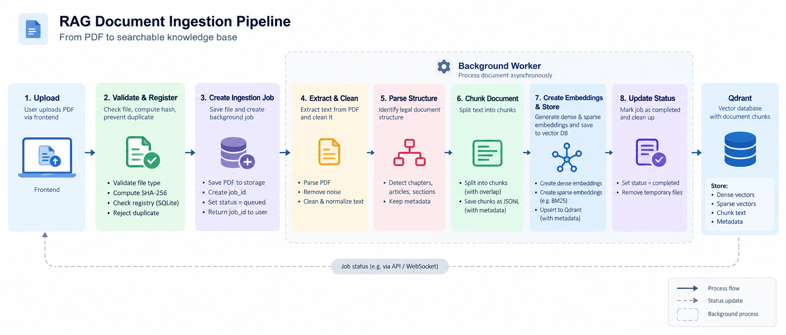
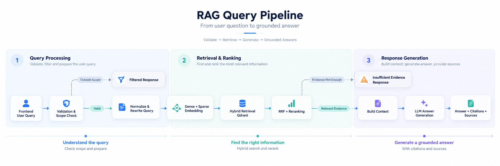

# Indonesian Labor Law RAG

Sistem Retrieval-Augmented Generation (RAG) untuk menjawab pertanyaan hukum ketenagakerjaan Indonesia berdasarkan PDF yang diunggah pengguna.

Pipeline: PDF → extraction/OCR → parsing hukum → embedding → Qdrant → hybrid retrieval → reranking → grounded answer + citation

Jawaban diberikan dalam Bahasa Indonesia dan dibatasi oleh dokumen yang berhasil diunggah, diekstrak, di-index, dan ditemukan oleh retrieval. Sistem ini adalah alat pencarian informasi, bukan pengganti nasihat hukum profesional.

## Fitur

- Upload satu atau beberapa PDF melalui UI atau REST API.
- Native extraction dengan PyMuPDF dan OCR Tesseract Bahasa Indonesia untuk scan.
- Normalisasi teks, penghapusan header/footer berulang, dan structure-aware chunking berdasarkan BAB, Pasal, serta Ayat.
- Metadata provenance: dokumen, halaman, BAB, Pasal, Ayat, dan chunk_id.
- Dense+sparse embedding BGE-M3 melalui DeepInfra.
- Hybrid retrieval dengan Reciprocal Rank Fusion (RRF), lalu Qwen3 reranking.
- Parent-context expansion pada tingkat Pasal.
- Scope filter, insufficient-evidence fallback, dan citation sumber.
- Progress ingestion melalui SSE serta duplicate detection berbasis SHA-256.
- React UI, FastAPI backend, Qdrant, dan Docker Compose.

## Arsitektur
### Diagram pipeline dokumen

Diagram ini menunjukkan alur pemrosesan dokumen dari PDF mentah, extraction/OCR,
parsing struktur hukum, embedding, hingga indexing ke Qdrant.

### Diagram user query pipeline

Diagram ini menunjukkan alur pertanyaan pengguna dari scope filtering, query
rewrite, hybrid retrieval, RRF, reranking, parent-context expansion, hingga
jawaban dengan citation.

## Tech Stack

| Komponen | Implementasi | Tanggung jawab |
|---|---|---|
| Frontend | React, TypeScript, Vite | Upload, progress, query, sumber |
| API | FastAPI | Upload, status, SSE, query, health |
| Extraction/OCR | PyMuPDF + Tesseract ind | Membaca native dan scanned PDF |
| Parser | Python utilities | Cleaning dan parsing struktur hukum |
| Embedding | BGE-M3 via DeepInfra | Dense dan sparse vector |
| Vector store | Qdrant | Penyimpanan dan pencarian vector |
| Reranker/LLM | Qwen3 via DeepInfra | Relevansi dan grounded answer |
| Registry | SQLite | Hash, status ingestion, duplicate detection |

## Alur sistem

### Ingestion

1. Upload membuat job_id dan mengembalikan status queued.
2. File disimpan sementara dan di-hash dengan SHA-256; dokumen identik ditolak.
3. Native extraction dicoba pada setiap halaman.
4. OCR selektif digunakan untuk halaman kosong/pendek atau text layer yang rusak.
5. Teks dinormalisasi, noise dibersihkan, dan header/footer berulang dihapus.
6. Parser mengenali BAB, Bagian, Paragraf, Pasal, dan Ayat.
7. Chunk maksimal 1.000 karakter dibuat dengan metadata halaman dan struktur.
8. BGE-M3 menghasilkan dense+sparse embedding secara batch.
9. Vector/metadata disimpan ke Qdrant dan chunk disimpan sebagai JSONL.
10. Status upload, parsing, embedding, indexing, completed, atau failed dikirim melalui SSE.

### Query

1. Query divalidasi dengan panjang 1–2.000 karakter.
2. LLM scope filter menilai apakah query berkaitan dengan hukum ketenagakerjaan.
3. Query yang lolos dinormalisasi dan diberi konteks retrieval tambahan.
4. Dense dan sparse vector dicari paralel, lalu digabungkan dengan RRF.
5. Kandidat direrank dan dipotong ke top-k.
6. Jika tidak ada evidence yang melewati RERANK_MIN_SCORE, generation dilewati.
7. Chunk lain dari Pasal yang sama dimuat sebagai parent context.
8. Chat model membuat jawaban hanya dari context terpilih.
9. Response berisi answer, sources, dan metadata retrieval.

## Design decisions dan trade-off

- Native-first extraction mengurangi biaya/noise OCR, tetapi threshold OCR bersifat heuristic.
- Pasal/Ayat menjadi semantic boundary agar citation mudah diverifikasi; format heading yang tidak umum dapat menurunkan kualitas parser.
- Dense retrieval membantu paraphrase, sparse retrieval menjaga istilah hukum, RRF menggabungkan keduanya.
- Reranking meningkatkan precision dengan tambahan latency dan biaya provider.
- DeepInfra menghindari kebutuhan GPU lokal, namun memerlukan API key, internet, biaya, dan bergantung pada availability provider.
- Job state disimpan in-memory agar setup sederhana; state hilang saat backend restart.

## Struktur repository

~~~text
.
├── backend/src/          # FastAPI, pipeline, repositories, models, prompts
├── backend/.env.example
├── backend/Dockerfile
├── frontend/src/         # React UI
├── frontend/Dockerfile
├── docker-compose.yml
├── openapi.yml            # OpenAPI 3.1 specification
├── pipeline-rag.txt
├── pipeline-user-query.txt
└── Technical Test - AI Engineer - Insignia.pdf
~~~

## How to Run - with Docker Compose

Prasyarat: Docker Engine, Docker Compose, DeepInfra API key, dan koneksi internet.

~~~bash
cp backend/.env.example backend/.env
~~~

Isi minimal:

~~~dotenv
DEEPINFRA_API_KEY=your_deepinfra_api_key
~~~

Jalankan:

~~~bash
docker compose up -d
~~~

Endpoint:

- UI: http://localhost:3000
- API: http://localhost:8000/v1/
- Swagger UI: http://localhost:8000/v1/docs
- Qdrant dashboard: http://localhost:6333/dashboard

## Konfigurasi Secret

| Variable | Default | Keterangan |
|---|---|---|
| DEEPINFRA_API_KEY | wajib | Credential provider |
| EMBEDDING_MODEL | BAAI/bge-m3-multi | Dense+sparse embedding |
| RERANKED_MODEL | Qwen/Qwen3-Reranker-4B | Reranking |
| GENERATIVE_MODEL | Qwen/Qwen3-32B | Scope filter dan generation |
| QDRANT_HOST | http://localhost:6333 | Qdrant REST endpoint |
| QDRANT_COLLECTION | insignia_labor_law_chunks | Nama collection |
| EMBEDDING_BATCH_SIZE | 8 | Ukuran batch embedding |
| RETRIEVAL_LIMIT | 20 | Kandidat per search |
| RERANK_TOP_K | 7 | Kandidat setelah rerank |
| RRF_K | 60 | Konstanta RRF |
| RERANK_MIN_SCORE | 0.05 | Minimum score |
| GENERATION_MAX_TOKENS | 8192 | Batas output |

Konfigurasi lain tersedia di backend/.env.example.

Spesifikasi OpenAPI lengkap tersedia di [openapi.yml](./openapi.yml) dan dapat
diimpor ke Swagger Editor, Postman, atau Insomnia.

## Example Question

~~~text
Berapa lama maksimal PKWT?
Apa syarat perpanjangan PKWT?
Apa hak pekerja ketika mengalami PHK?
Berapa lama waktu istirahat setelah bekerja empat jam terus-menerus?
Apa isi Pasal 8 PP Nomor 35 Tahun 2021?
Hak saya  # query ambigu
Siapa pemenang pertandingan sepak bola kemarin?  # harus ditolak
~~~

## Limitasi

- OCR dapat menghasilkan noise pada scan buram, miring, tabel, cap, tanda tangan, dan layout multi-column.
- Bagian PENJELASAN belum menjadi knowledge base utama.
- Chunk tidak memakai overlap; konteks di batas part dapat berkurang.
- Citation belum divalidasi otomatis per klaim.
- Tidak ada authentication, multi-tenancy, atau conversation history.
- Sistem tidak menjamin jawaban hukum final.

## Penggunaan agentic coding tool

Pada tahap perencanaan, ChatGPT digunakan untuk membantu menyusun PRD dan alur
pipeline dokumen, memperoleh insight awal, serta mencari referensi pendekatan
chunking yang sesuai untuk dokumen hukum/legal. Hasilnya direview dan
disesuaikan dengan requirement technical test agar keputusan desain tetap
relevan terhadap kebutuhan sistem RAG.

Setelah rancangan ditetapkan, tools Codex digunakan untuk mengubah PRD
menjadi implementasi aplikasi secara terstruktur. Codex membantu mengerjakan
bagian ingestion, retrieval, query pipeline, dokumentasi, dan verifikasi teknis
dengan tetap mengikuti konteks desain yang telah dibuat sebelumnya.

Code, keputusan arsitektur, hasil retrieval, dan citation tetap ditinjau secara manual;
AI digunakan sebagai partner engineering untuk mempercepat pekerjaan.
