# Indonesian Labor Law RAG

Sistem Retrieval-Augmented Generation (RAG) untuk menjawab pertanyaan hukum
ketenagakerjaan Indonesia dalam Bahasa Indonesia berdasarkan dua regulasi:

1. UU No. 13 Tahun 2003 tentang Ketenagakerjaan
2. PP No. 35 Tahun 2021 tentang PKWT, Alih Daya, Waktu Kerja, dan PHK

Proyek ini dibuat untuk memenuhi [Technical Test - AI/ML Engineer -
Insignia](./Technical%20Test%20-%20AI%20Engineer%20-%20Insignia.pdf). Fokus
implementasinya adalah pipeline yang dapat dijalankan dari raw PDF sampai jawaban
yang memiliki sumber, bukan sekadar demo prompt atau dokumentasi arsitektur.

> Sistem ini merupakan alat pencarian informasi, bukan pengganti nasihat hukum
> profesional. Jawaban dibatasi oleh isi dokumen yang telah diunggah dan kualitas
> hasil ekstraksi, retrieval, serta model yang digunakan.

## Fitur utama

- upload satu atau beberapa PDF melalui UI atau REST API;
- native text extraction dengan PyMuPDF;
- native-first extraction dan full-page OCR ketika native text kurang dari 200
  karakter serta image terbesar menutupi minimal 70% halaman;
- normalisasi teks dan penghapusan header/footer berulang;
- structure-aware chunking berdasarkan BAB, Pasal, dan Ayat;
- SHA-256 duplicate detection dengan persistent SQLite document registry;
- dense dan sparse embedding BGE-M3 melalui DeepInfra;
- hybrid retrieval dari Qdrant dengan Reciprocal Rank Fusion (RRF);
- reranking kandidat sebelum context diberikan kepada LLM;
- parent-context expansion pada tingkat Pasal;
- jawaban Bahasa Indonesia yang dibatasi pada retrieved context;
- citation nama dokumen, halaman, Pasal/Ayat, dan chunk ID;
- fallback ketika evidence tidak mencukupi;
- background document processing dengan progress melalui Server-Sent Events (SSE);
- React UI, FastAPI backend, dan Qdrant yang dibundel dengan Docker Compose.

## Arsitektur sistem

```mermaid
flowchart LR
    User[Evaluator / User]
    UI[React UI<br/>Nginx]
    API[FastAPI]
    Jobs[Background ingestion job<br/>in-memory status + SSE]
    PDF[PyMuPDF extractor]
    OCR[Tesseract OCR<br/>language: ind]
    Parser[Text cleaner +<br/>legal structure parser]
    Embed[DeepInfra<br/>BGE-M3 dense + sparse]
    Qdrant[(Qdrant)]
    Scope[LLM scope filter]
    Rewrite[Normalize +<br/>mandatory query rewrite]
    Fusion[Dense & sparse search<br/>RRF fusion]
    Rerank[DeepInfra reranker]
    Context[Pasal context expansion]
    LLM[DeepInfra chat model]
    Result[Answer + citations]

    User --> UI
    UI -->|POST /v1/documents/upload| API
    API --> Jobs
    Jobs --> PDF
    PDF -->|native text < 200 chars<br/>and image coverage >= 70%| OCR
    PDF -->|otherwise use native text| Parser
    OCR --> Parser
    Parser --> Embed
    Embed --> Qdrant
    Jobs -. progress events .-> UI

    UI -->|POST /v1/query| API
    API --> Scope
    Scope -->|labor-law query| Rewrite
    Scope -->|out of scope| Result
    Rewrite --> Embed
    Embed --> Fusion
    Qdrant --> Fusion
    Fusion --> Rerank
    Rerank --> Context
    Context --> Qdrant
    Context --> LLM
    LLM --> Result
    Result --> UI
```



### Komponen

| Komponen | Implementasi | Tanggung jawab |
|---|---|---|
| Web interface | React, TypeScript, Vite | Upload dokumen, menampilkan progress, mengirim query, dan menampilkan sumber |
| API | FastAPI | Endpoint system, ingestion, progress, dan query |
| PDF processing | PyMuPDF + Tesseract | Native extraction, OCR, normalisasi, dan pemetaan halaman |
| Chunking | Parser Python khusus | Mempertahankan struktur BAB, Pasal, Ayat, dan part |
| Embedding | BGE-M3 via DeepInfra | Menghasilkan dense dan sparse vector dalam satu request |
| Vector store | Qdrant | Menyimpan named vectors dan metadata sumber |
| Fusion | RRF di application layer | Menggabungkan ranking dense dan sparse |
| Reranking | Qwen3 Reranker via DeepInfra | Mengurutkan kandidat berdasarkan relevansi terhadap query |
| Generation | Model chat configurable via DeepInfra | Membuat jawaban Bahasa Indonesia dari context terpilih |
| Deployment | Docker Compose + Nginx | Menjalankan frontend, backend, dan Qdrant dalam satu network |

Backend memakai dependency injection eksplisit dengan alur yang sama untuk setiap
domain endpoint:

```text
route -> handler -> service -> repository
                     |
                     +-> utils/<domain>/<domain>_utils.py
```

- `routes/v1`: hanya mendefinisikan path HTTP dan meneruskan request ke handler.
- `handlers`: meneruskan input HTTP ke business operation pada service.
- `services`: berisi fungsi yang langsung merepresentasikan endpoint.
- `repositories`: mengisolasi akses SQLite, Qdrant, dan provider eksternal.
- `models/*_model.py`: menyimpan dataclass dan request model per domain/tag.
- `utils/query` dan `utils/document`: menyimpan seluruh fungsi pendukung domain;
  pipeline upload bernomor berada di `utils/document/upload_pipeline_utils.py`.
- `main.py`: composition root untuk config, dependency wiring, lifecycle, dan FastAPI.

## Alur ingestion dokumen

1. Pengguna mengunggah PDF melalui `POST /v1/documents/upload`.
2. API menyimpan file ke workspace sementara, membuat `ingestion_id`, lalu segera
   mengembalikan `job_id`.
3. Backend selalu mencoba native extraction. Full-page OCR hanya dijalankan bila
   native text kurang dari 200 karakter dan image terbesar menutupi minimal 70%
   area halaman.
4. Hasil halaman disusun kembali berdasarkan nomor halaman, dinormalisasi, dan
   dibersihkan dari noise serta header/footer berulang.
5. Parser mengenali batas BAB, Bagian, Paragraf, Pasal, dan Ayat. Chunk disimpan
   per Pasal/Ayat dengan panjang maksimal 1.000 karakter.
6. BGE-M3 menghasilkan vector `dense` dan `sparse` secara batch.
7. Backend membuat collection Qdrant bila belum ada dan melakukan upsert point.
8. SHA-256 PDF dan status ingestion disimpan di SQLite. File identik yang masih
   queued, processing, atau completed ditolak sebagai duplicate.
9. Status `upload`, `parsing`, `embedding`, `indexing`, `completed`, atau `failed`
   dikirim ke frontend melalui SSE.

Metadata utama setiap chunk:

```text
filename, bab, bab_title, pasal, ayat, part,
page_start, page_end, pages, text, chunk_id,
point_id, ingestion_id, embedding_model
```

Salinan chunk hasil parsing juga disimpan sebagai JSONL di
`backend/data/chunks`. Direktori tersebut merupakan runtime data dan tidak masuk
Git.

## Alur query

1. Query divalidasi dan diperiksa oleh early scope filter.
2. Setiap query yang lolos scope filter dinormalisasi dan diberi tambahan konteks
   retrieval secara deterministik tanpa mengganti intent pertanyaan asli.
3. BGE-M3 membuat dense dan sparse query vector.
4. Kedua vector dicari secara paralel di Qdrant, masing-masing dengan default
   `RETRIEVAL_LIMIT=20`.
5. Hasil digabungkan menggunakan RRF dengan default `RRF_K=60`.
6. Kandidat direrank dan dipilih maksimal `RERANK_TOP_K=7`.
7. Backend mengambil chunk lain dari Pasal yang sama sebagai parent context.
8. LLM menerima query asli yang sudah dinormalisasi dan labeled context.
9. Response berisi jawaban, daftar sumber, serta metadata retrieval.

Jika tidak ada kandidat yang melewati `RERANK_MIN_SCORE`, generation dilewati dan
sistem mengembalikan pesan bahwa dasar yang cukup tidak ditemukan.

## Keputusan desain

### Structure-aware chunking

Dokumen hukum tidak ideal dipotong hanya berdasarkan jumlah token. Pasal dan Ayat
dipakai sebagai semantic boundary agar sebuah chunk tetap memiliki konteks hukum
dan metadata yang dapat ditelusuri. Batas 1.000 karakter membatasi ukuran request
embedding, sedangkan Pasal yang panjang dibagi menjadi beberapa `part`.

### BGE-M3 untuk dense dan sparse retrieval

BGE-M3 dipilih karena mendukung teks multilingual dan dapat menghasilkan dense
serta sparse representation dari model yang sama. Dense retrieval membantu
paraphrase dan kemiripan makna, sementara sparse retrieval mempertahankan istilah
hukum, singkatan, keyword, dan referensi Pasal.

### RRF sebelum reranking

Dense dan sparse score tidak selalu berada pada skala yang sebanding. RRF
menggabungkan posisi ranking tanpa memerlukan score calibration. Cross-encoder
reranker kemudian digunakan pada candidate set yang lebih kecil untuk meningkatkan
precision sebelum generation.

### Parent-context expansion

Retrieval dan reranking tetap menggunakan child chunk yang ringkas. Setelah
reranking, backend mengambil bagian lain dari Pasal yang sama agar LLM dapat melihat
konteks ketentuan secara lebih lengkap tanpa memperbesar seluruh retrieval corpus.

### Provider melalui HTTP API

Embedding, reranker, dan generative model diakses melalui DeepInfra agar evaluator
tidak perlu menyediakan GPU lokal. Nama model dikonfigurasi melalui environment
variable sehingga implementasi tidak terikat pada satu generative model.

### Background ingestion dan SSE

OCR serta embedding dokumen dapat membutuhkan waktu. Endpoint upload karena itu
segera mengembalikan `job_id`, sedangkan pekerjaan berjalan di background dan UI
menerima progress melalui SSE.

## Trade-off

| Keputusan | Keuntungan | Konsekuensi |
|---|---|---|
| DeepInfra, bukan local inference | Setup ringan dan tidak membutuhkan GPU | Membutuhkan internet, API key, dan menambah biaya/latency provider |
| Native-first OCR threshold | Header/footer image kecil tidak memicu OCR | Threshold 200 karakter dan 70% coverage masih heuristic statis |
| Chunk maksimal 1.000 karakter tanpa overlap | Index lebih kecil dan metadata lebih mudah dipahami | Kalimat di batas part dapat kehilangan konteks lokal |
| RRF di backend | Transparan dan mudah diuji | Dua request search dibutuhkan sebelum fusion |
| Parent expansion saat query | Context Pasal lebih lengkap tanpa parent index terpisah | Menambah request ke Qdrant dan ukuran prompt |
| Job state in-memory | Implementasi sederhana untuk technical test | Status job hilang ketika backend restart dan tidak cocok untuk multi-replica |
| SHA-256 registry di SQLite | File identik dapat ditolak meski namanya berubah | Perubahan isi menghasilkan hash baru dan belum otomatis mengganti versi lama |
| Upload corpus melalui UI/API | Evaluator dapat mencoba raw PDF secara langsung | Qdrant baru masih kosong sampai dokumen selesai diunggah |

## Struktur repository

```text
.
├── backend/
│   ├── src/
│   │   ├── core/          # configuration, errors, exception handlers
│   │   ├── handlers/      # HTTP handler boundary
│   │   ├── models/        # request and compatibility models
│   │   ├── prompt/        # scope and generation prompts
│   │   ├── repositories/  # Qdrant REST client
│   │   ├── routes/v1/     # API route registry
│   │   ├── services/      # ingestion, embedding, retrieval, generation, progress
│   │   └── main.py
│   ├── tests/
│   ├── Dockerfile
│   ├── pyproject.toml
│   └── uv.lock
├── frontend/
│   ├── src/
│   ├── Dockerfile
│   └── nginx.conf
├── docker-compose.yml
├── pipeline-rag.txt
├── pipeline-user-query.txt
└── Technical Test - AI Engineer - Insignia.pdf
```

## Menjalankan dengan Docker Compose

### Prasyarat

- Docker Engine dengan Docker Compose;
- koneksi internet untuk mengunduh image dan mengakses DeepInfra;
- DeepInfra API key.

Salin contoh konfigurasi:

```bash
cp backend/.env.example backend/.env
```

Isi minimal:

```dotenv
DEEPINFRA_API_KEY=your_deepinfra_api_key
```

Jalankan seluruh service:

```bash
docker compose up --build
```

Service tersedia pada:

- frontend: <http://localhost:3000>
- backend dan Swagger UI: <http://localhost:8000/v1/> dan <http://localhost:8000/v1/docs>
- Qdrant REST/dashboard: <http://localhost:6333> dan <http://localhost:6333/dashboard>

Frontend Nginx meneruskan request `/v1` dan `/documents` ke backend. Di dalam
Compose, `QDRANT_HOST` otomatis ditimpa menjadi `http://qdrant:6333`.

Perintah operasional:

```bash
# Jalankan di background
docker compose up --build -d

# Periksa status dan log
docker compose ps
docker compose logs -f

# Hentikan tanpa menghapus indexed data
docker compose down

# Hentikan dan hapus seluruh runtime data Qdrant/backend
docker compose down -v
```

## Menjalankan backend secara lokal

Backend memakai [uv](https://docs.astral.sh/uv/) sebagai package manager.
Tesseract dan language pack Bahasa Indonesia diperlukan untuk scanned PDF.

Contoh instalasi OCR pada Debian/Ubuntu:

```bash
sudo apt-get install tesseract-ocr tesseract-ocr-ind
```

Jalankan backend:

```bash
cd backend
cp .env.example .env
# Isi DEEPINFRA_API_KEY dan pastikan QDRANT_HOST dapat diakses.
uv sync
uv run uvicorn src.main:app --reload
```

Jalankan frontend pada terminal lain:

```bash
cd frontend
npm ci
npm run dev
```

Vite development server tersedia pada <http://localhost:5173>. Nilai
`VITE_API_URL` default untuk mode development adalah `http://localhost:8000`.

## Menggunakan aplikasi

Saat Qdrant masih kosong, unggah kedua PDF regulasi melalui tab **Upload
Document** dan tunggu hingga masing-masing berstatus `Terindeks`. Setelah itu buka
tab **Asking** dan ajukan pertanyaan dalam Bahasa Indonesia.

Contoh pertanyaan:

```text
Berapa lama maksimal PKWT?
Apa hak pekerja ketika mengalami PHK?
Berapa lama waktu istirahat setelah bekerja empat jam terus-menerus?
Apa isi Pasal 8 PP Nomor 35 Tahun 2021?
```

### Upload melalui API

```bash
curl -X POST http://localhost:8000/v1/documents/upload \
  -F 'files=@/path/to/1 UU No. 13 Tahun 2003 tentang Ketenagakerjaan.pdf' \
  -F 'files=@/path/to/2 PP No. 35 Tahun 2021 tentang PKWT, Alih Daya, Waktu Kerja, dan PHK.pdf'
```

Response upload:

```json
{
  "job_id": "<job-id>",
  "status": "queued",
  "message": "Upload diterima dan pemrosesan berjalan di background",
  "files": [
    {"filename": "peraturan.pdf", "status": "queued"}
  ],
  "failed": []
}
```

Jika satu-satunya file memiliki SHA-256 yang sama dengan dokumen berstatus
`queued`, `processing`, atau `completed`, API mengembalikan HTTP `409` dengan
pesan `Dokumen sudah pernah diinput`. Duplicate dalam multi-file upload dimasukkan
ke array `failed`, sementara file baru tetap diproses. Ingestion berstatus `failed`
boleh dicoba ulang.

Pantau progress dengan SSE:

```bash
curl -N http://localhost:8000/v1/documents/<job-id>/events
```

Riwayat status juga tersedia melalui:

```bash
curl http://localhost:8000/v1/documents/<job-id>/status
```

### Query melalui API

```bash
curl -X POST http://localhost:8000/v1/query \
  -H 'Content-Type: application/json' \
  -d '{"query":"Berapa lama maksimal PKWT?"}'
```

Contoh bentuk response:

```json
{
  "answer": "PKWT berdasarkan jangka waktu dapat dibuat paling lama lima tahun [1].",
  "sources": [
    {
      "id": 1,
      "document": "2 PP No. 35 Tahun 2021 tentang PKWT, Alih Daya, Waktu Kerja, dan PHK.pdf",
      "page": 7,
      "article": "Pasal 8",
      "paragraph": "Ayat 1",
      "chunk_id": "...",
      "text": "...",
      "rerank_score": 0.91
    }
  ],
  "retrieval": {
    "query": "Berapa lama maksimal PKWT?",
    "normalized_query": "Berapa lama maksimal PKWT?",
    "rewritten_query": "Berapa lama maksimal PKWT? menurut peraturan ketenagakerjaan Indonesia",
    "candidate_chunks": 20,
    "reranked_chunks": 7,
    "retrieved_chunks": 7,
    "latency_ms": 1234.56
  }
}
```

Nilai response di atas hanya menggambarkan schema. Score, latency, jumlah sumber,
dan redaksi jawaban bergantung pada dokumen serta model yang digunakan.

Endpoint system:

```text
GET /v1/          informasi dasar API
GET /v1/health    liveness check
GET /v1/docs      Swagger UI
```

## Konfigurasi

Konfigurasi runtime utama berada di `backend/src/core/config.py`; nilai yang perlu
diubah untuk penggunaan normal dicontohkan di `backend/.env.example`:

| Variable | Default | Keterangan |
|---|---|---|
| `DEEPINFRA_API_KEY` | wajib diisi | Credential DeepInfra |
| `DEEPINFRA_BASE_URL` | `https://api.deepinfra.com/v1` | Base URL provider |
| `EMBEDDING_MODEL` | `BAAI/bge-m3-multi` | Dense dan sparse embedding model |
| `RERANKED_MODEL` | `Qwen/Qwen3-Reranker-4B` | Reranking model |
| `GENERATIVE_MODEL` | `Qwen/Qwen3-32B` | Scope filter dan answer model |
| `QDRANT_HOST` | `http://localhost:6333` | Qdrant REST endpoint |
| `QDRANT_API_KEY` | kosong | Optional Qdrant API key |
| `QDRANT_COLLECTION` | `insignia_labor_law_chunks` | Collection name |
| `EMBEDDING_BATCH_SIZE` | `8` | Chunk per embedding/upsert batch |
| `HTTP_TIMEOUT_SECONDS` | `120` | Provider dan Qdrant timeout |
| `RETRIEVAL_LIMIT` | `20` | Kandidat per search dan setelah RRF |
| `RERANK_TOP_K` | `7` | Maksimum context hasil reranking |
| `RRF_K` | `60` | Konstanta rank fusion |
| `RERANK_MIN_SCORE` | `0.05` | Minimum reranker score |
| `GENERATION_MAX_TOKENS` | `8192` | Batas output generation |
| `LOG_LEVEL` | `INFO` | Level logging backend |

Secret tidak disimpan di source code. File `.env` diabaikan oleh Git.

## Testing dan verifikasi

Backend:

```bash
cd backend
uv sync
uv run python -m unittest discover -s tests -v
```

Test mencakup text cleaning, threshold native/OCR, urutan hasil parallel OCR,
document hash registry, duplicate-upload response, chunk identity, parsing sparse
embedding, pembuatan hybrid Qdrant collection, RRF, query normalization, reranking
response, insufficient evidence, scope filter, dan progress SSE.

Frontend:

```bash
cd frontend
npm ci
npm run lint
npm run build
```

Validasi Compose:

```bash
docker compose config --quiet
```

## Observability dan failure handling

Backend menulis log terstruktur sederhana ke stdout untuk:

- document job, filename, stage, dan status;
- embedding model, batch size, dan dimensions;
- Qdrant collection serta jumlah point;
- query, jumlah retrieved chunk, dan total latency;
- provider, parsing, OCR, indexing, dan unexpected errors.

Failure pada satu file dalam multi-file upload tidak menghentikan file lain. Error
dari embedding, Qdrant, reranker, dan generative provider diubah menjadi response
JSON yang aman. Empty retrieval menghasilkan jawaban insufficient-evidence tanpa
memanggil generation.

## Keterbatasan

- Page classifier memakai threshold statis: native text kurang dari 200 karakter
  dan image terbesar minimal 70% halaman. Borderline page dapat tetap salah
  diklasifikasikan.
- OCR hanya menggunakan Tesseract Bahasa Indonesia. Scan buram, miring, tabel, cap,
  tanda tangan, atau layout multi-column dapat menghasilkan noise.
- Parser mengandalkan heading hukum yang muncul sebagai baris terpisah. Variasi
  layout atau OCR pada teks `BAB`, `Pasal`, dan `Ayat` dapat mengurangi kualitas
  struktur chunk.
- Parser berhenti saat menemukan heading `PENJELASAN`; bagian penjelasan regulasi
  belum masuk knowledge base.
- Chunk tidak memiliki overlap. Pasal yang dibagi menjadi beberapa part dapat
  kehilangan sedikit konteks pada batas part.
- Parent context dirakit berdasarkan pasangan filename dan Pasal, bukan melalui
  parent object khusus.
- File dengan SHA-256 identik ditolak, tetapi file revisi dengan isi berbeda masih
  dianggap dokumen baru dan belum menggantikan versi regulasi sebelumnya.
- Validation citation masih bergantung pada marker sumber dari LLM dan belum
  melakukan entailment check per klaim.
- Early scope filter menggunakan LLM sehingga dapat salah menilai query yang sangat
  ambigu atau terlalu pendek.
- Job progress disimpan in-memory. Restart backend membuat history SSE lama hilang.
- `/v1/health` adalah liveness check dan belum memverifikasi DeepInfra atau Qdrant.
- Belum tersedia authentication, rate limiting, persistent conversation history,
  dan production job queue.
- Retrieval dan generation masih bergantung pada koneksi serta availability
  DeepInfra.

## Pengembangan berikutnya

Prioritas pengembangan jika tersedia lebih banyak waktu:

1. Menambah text-quality dan OCR-confidence scoring pada native-first page
   classifier agar tidak hanya bergantung pada character count dan image coverage.
2. Menambahkan deskew, image preprocessing, dan OCR quality report.
3. Menyimpan explicit parent-child records dan memastikan halaman citation berasal
   dari evidence yang benar-benar dipakai pada jawaban.
4. Menambahkan semantic document versioning serta endpoint delete/re-index.
5. Membuat evaluation dataset yang mencakup exact query, paraphrase, Pasal, query
   ambigu, multi-chunk answer, dan pertanyaan tanpa jawaban.
6. Mengukur Recall@k, MRR/nDCG, reranker improvement, answer groundedness, dan
   citation correctness.
7. Menambahkan citation validator per kalimat dan menolak citation ID yang tidak
   tersedia.
8. Memindahkan background job ke durable queue dan menyimpan progress di database
   untuk mendukung restart serta multi-replica deployment.
9. Menambahkan readiness endpoint, tracing per stage, rate limiting, dan budget
   control untuk request model.
10. Menambah integration test dengan Qdrant serta end-to-end test menggunakan kedua
    PDF sumber.

## Penggunaan agentic coding tool

Codex digunakan selama development sebagai collaborative coding assistant. Workflow
yang digunakan:

1. Requirement pada technical test diterjemahkan menjadi PRD dan diagram pipeline
   ingestion/query sebelum perubahan implementasi dilakukan.
2. Codex diminta menelusuri codebase dan mempertahankan pemisahan route, handler,
   service, repository, model, prompt, serta configuration.
3. Perubahan dibuat secara bertahap: document ingestion, hybrid index, query
   pipeline, frontend integration, progress reporting, kemudian containerization.
4. Untuk setiap tahap, perilaku aktual dicatat dalam `pipeline-rag.txt` dan
   `pipeline-user-query.txt` agar diagram tidak berbeda dari implementasi.
5. Hasil diverifikasi menggunakan unit test backend, frontend lint/build, validasi
   Compose, dan code review terhadap requirement technical test.
6. Keputusan akhir, credential, pemilihan provider, dan validasi kualitas jawaban
   tetap dilakukan oleh developer; output agent tidak dianggap benar tanpa test dan
   pemeriksaan source code.

Codex terutama dipakai untuk eksplorasi repository, implementasi terarah,
refactoring, penyusunan test, dokumentasi, dan re-check terhadap acceptance
criteria. Prompt dan instruksi kerja dibatasi pada perubahan yang sedang dikerjakan
agar agent tidak melakukan refactor di luar scope.

## Dokumen tambahan

- [`pipeline-rag.txt`](./pipeline-rag.txt): perilaku ingestion aktual secara rinci.
- [`pipeline-user-query.txt`](./pipeline-user-query.txt): perilaku query pipeline
  aktual secara rinci.
- [`PRD_Indonesian_Labor_Law_RAG.md`](./PRD_Indonesian_Labor_Law_RAG.md): pemetaan
  requirement dan acceptance criteria internal.
- [`Technical Test - AI Engineer - Insignia.pdf`](./Technical%20Test%20-%20AI%20Engineer%20-%20Insignia.pdf): dokumen technical test sumber.

## License

Belum ada license open-source yang ditetapkan untuk repository ini. Dokumen hukum
yang digunakan sebagai dataset tidak didistribusikan ulang melalui runtime data
repository.
